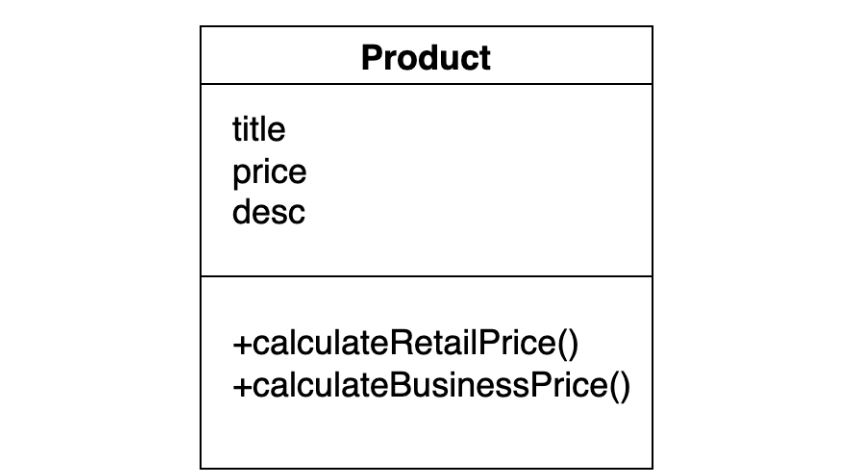

# Why S.O.L.I.D ?

The broad goal of the SOLID principles is to **reduce dependencies so that engineers change one area of software without
impacting others.** Additionally, they’re intended to make designs easier to understand, maintain, and extend.

Using these design principles makes it easier for software engineers to avoid issues and to build **adaptive, effective,
and agile software.**

# Problems & Solution using SOLID

**Readable:** We are constantly reading old code as part of the
effort to write code. We spend more time reading
than writing code. This becomes more complex day by day when
more code is added & team grows.

**Testable:** It should be easy to write automated tests that
assert the system’s behavior. The profound reason is that we
don’t want to spend too much time verifying that the system is
effective. Running manual tests are very costlier than building software.

**Extensible:** It should be easy to add additional functionality
to the system. A big part of this comes
from readability. Readability is a necessary but not a sufficient
element to enable extensibility. We implement SOLID patterns which enable readability.

**Robust:** Adding additional functionality should not
introduce much risk of breaking existing functionality.

**Maintainable:** When a defect is reported, it should be easy
to track it down and fix it.

By Applying S.O.L.I.D we can achieve all these things that mentioned above.

# What is SOLID?

**SRP** - **S**ingle **R**esponsibility **P**rinciple  
A class should do one thing and therefore it should have only a single reason to change.

**Open-Closed Principle**  
Classes should be open for extension and closed to modification.

**Liskov Substitution Principle**  
Super class should be replacable by it's sub classs.

**Interface Segregation Principle**   
Segregation means keeping things separated, and the Interface Segregation Principle is about separating the interfaces.

**Dependency Inversion Principle**   
Classes should depend upon **interfaces or abstract classes** instead of concrete classes and functions.

## Single Responsibility Principle

**SRP** also helps to have less Merge conflict as everything will be separated and place in separated class, There will
be less merge conflicts.

### Basic Example



This `Product` object violates the SRP principle. Product class should not have the business
responsibility like `calculateRetailPrice()` or `calculateBusinessPrice()`

### Solution

Create separate `Calculator` class so changes become easy and introduce less merge conflicts.


so, final result will be this


### Another Example with Code

```kotlin
class Invoice(
    val book: Book,
    val quantity: Int,
    val discountRate: Double,
    val taxRate: Double
) {
    val total: Double

    init {
        total = calculateTotal()
    }

    fun calculateTotal(): Double {
        val price: Double = (book.price - book.price * discountRate) * quantity
        return price * (1 + taxRate)
    }

    // Violation: #1 - printing invoice should not be Invoice responsibility
    fun printInvoice() {
        println(quantity.toString() + "x " + book.name + " " + book.price + "$")
        println("Discount Rate: $discountRate")
        println("Tax Rate: $taxRate")
        println("Total: $total")
    }

    // Violation: #2 - saving file should not be Invoice responsibility
    fun saveToFile(filename: String?) {
        // Creates a file with given name and writes the invoice
    }
}
```
### Solution
Create 2 classes `InvoicePrinter` & `InvoicePersistance` to delegate the separated responsibility

```kotlin
class InvoicePrinter(val invoice: Invoice) {
    
        fun print() {
            println(((invoice.quantity + "x " + invoice.book.name).toString() + " " + invoice.book.price).toString() + " $")
            System.out.println("Discount Rate: " + invoice.discountRate)
            System.out.println("Tax Rate: " + invoice.taxRate)
            System.out.println("Total: " + invoice.total + " $")
        }
    }
```

```kotlin
class InvoicePersistence(val invoice: Invoice) {
    
    fun saveToFile(filename: String?) {
        // Creates a file with given name and writes the invoice
    }
}
```

```kotlin
class Invoice(
    val book: Book,
    val quantity: Int,
    val discountRate: Double,
    val taxRate: Double
) {
    private val total: Double

    init {
        total = calculateTotal()
    }

    fun calculateTotal(): Double {
        val price: Double = (book.price - book.price * discountRate) * quantity
        return price * (1 + taxRate)
    }
}
```

So `main.kt` function will be
```kotlin

fun main(args: Array<String>) {
    val book = Book(
        name = "Clean Architecture",
        price = 1090.0
    )
    val invoice = Invoice(
        book = book,
        quantity = 1,
        discountRate = 1.2,
        taxRate = 15
    )
    
    val invoicePrinter = InvoicePrinter(invoice)
    invoicePrinter.print()
    
    val invoicePersistence = InvoicePersistence(invoice)
    invoicePersistence.saveToFile()
}

data class Book(
    val name : String,
    val price : Double
)

```

# Open-Closed Principle
Let's assume, after first release Product Owner comes to us and want to add a new feature. From now on, we need to also save the invoice to server.  
Seems like easy solution, right? Without thinking further we want to make this easy change. So, we open our `InvoicePersistence` class and add a new method,

```kotlin
class InvoicePersistence(val invoice: Invoice) {
    
    fun saveToFile(filename: String?) {
        // Creates a file with given name and writes the invoice
    }

    fun saveToServer(filename: String?) {
        // Implementation of saving file to server
    }
}
```

### Problem
Now, you broke 2 rules,  
**1. Single Responsibility Principle:**  *A class should be only one reason to change.*  
Look at the code, we are totally having a new reason now. `saveToServer()` which is totally different from saving invoice to a file locally.

**2. Open-Closed Principle:** *A class should be open for extension & close for modification*.   
We're not extending a `saveToServer()` feature. We're modifying this class to adapt a new feature which break this rule.

### Solution
We can introduce and take advantage of `OOP's` interface to fix the problem with `Open-Closed` principle.

```kotlin
interface InvoiceSaver {
    fun save()
} 
```

Now, let's implement this interface and add the requirements in two separated class so that it follows `SRP`
```kotlin
class Server : InvoiceSaver {
    override fun save() {
        // Save to server
    }
}

class FileSystem : InvoiceSaver {
    override fun save() {
        // Save to file
    }
}
```

Now, we also need to add what type of save strategy we'll use. So, let's create `enum` for invoice *SavingType*

```kotlin
enum class SaveType {
    File, Server
}
```

Now, we have to completely refactor the `InvoicePersistence` class to make it abid the SRP & Open-Closed principle.
So, refactor it to this,
```kotlin
class InvoicePersistence() {
    fun store(invoice: Invoice): InvoiceSaver = when (invoice.saveType) {
        SaveType.File -> Server()
        SaveType.Server -> FileSystem()
    }
}
```

Without refactoring/changing the code, we can not introduce new principles.

When a new feature or change request comes and the code is not `Open-Closed` principle compliant then we should
first refactor the code to accept the change as Kent Beck said,
>make the change easy, then make the easy change.

Everything is now set, so the final `main.kt` will be
```kotlin
fun main(args: Array<String>) {
    val book = Book(
        name = "Clean Architecture", price = 1090.0
    )
    val invoice = Invoice(
        book = book, quantity = 1, discountRate = 1.2, taxRate = 15.0, saveType = SaveType.File
    )
    
    // InvoicePersistence stores the invoice based on SaveType and
    // delegates it implementation on a separate class
    val invoicePersistence = InvoicePersistence()
    invoicePersistence.store(invoice)

}
```
### Handle change request
Now, if tomorrow Product Owner asks for saving the `invoice` to **LocalDatabase**, the cnange will be very easy for us to add without risking other codes,

we just new to add `LocalDatabase` save type to `SaveType` enum class and we need to create another class which only be responsible for saving the invoice to local database. Here's the code,

1. Add a new save type `LocalDatabase`

```diff
enum class SaveType {
-    File, Server
+    File, Server, LocalDatabase, 
}
```

2. Add `LocalDatabase` class to implement saving file to local database
```kotlin
class LocalDatabase: InvoiceSaver {
    override fun save() {
        // Save to local database
    }
}
```

3. Add `LocalDatabase` to `InvoicePersistence` for specifying saving strategy
```diff
class InvoicePersistence() {
    fun store(invoice: Invoice): InvoiceSaver = when (invoice.saveType) {
        SaveType.File -> Server()
        SaveType.Server -> FileSystem()
+        SaveType.LocalDatabase -> LocalDatabase()
    }
}
```

That's all. Our `InvoicePersistence` is now capabale of saving invoice to even LocalDatabase.   

Check that when we implemented new saving to database feature, we didn't, *modified any of our class* and only *added new feature change* to new class. So, there's no risk of breaking other parts of the code as we almost never touched other code.
